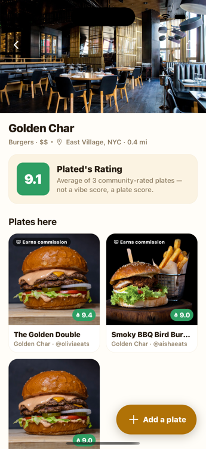
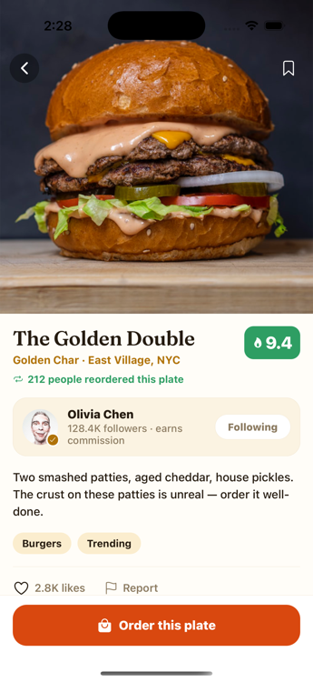
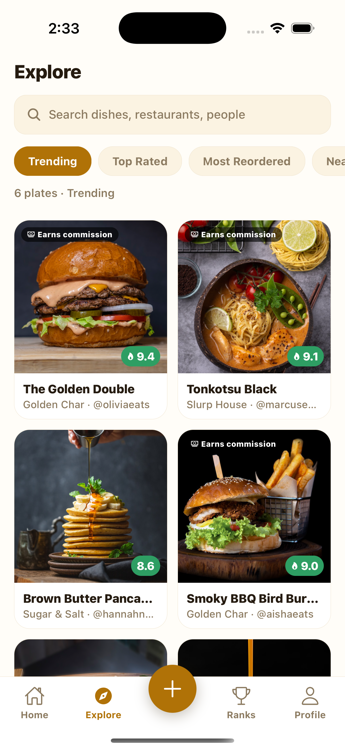
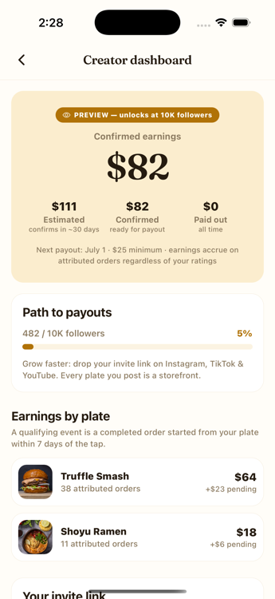
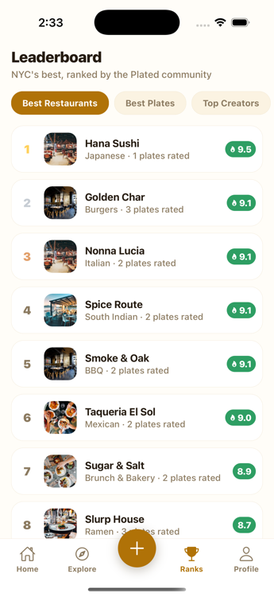
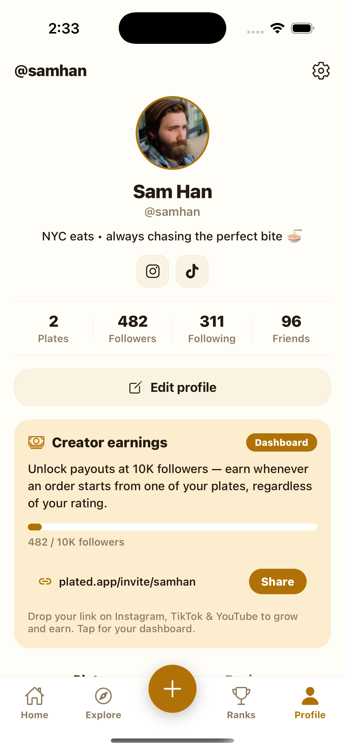
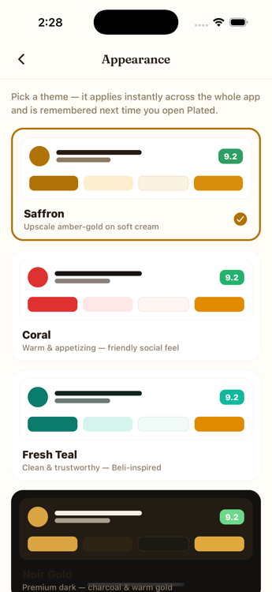
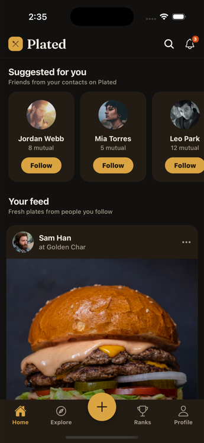

<div align="center">


# Plated

**Rate the dish, not the restaurant — then order the exact plate someone vouched for.**

A social food-discovery app where the unit of rating is the individual **dish**, not the venue.
Browse a feed of real plates people loved, see a restaurant's cumulative **"Plated's Rating,"**
and hand off to DoorDash / Uber Eats / pickup to order the specific dish — not just the spot.

[](https://docs.expo.dev/)
[](https://reactnative.dev/)
[](https://www.typescriptlang.org/)
[](https://docs.expo.dev/router/introduction/)
[](#)

</div>

> **Status:** working prototype, ~100% TypeScript, runs on iOS / Android / web from one codebase.
> "Plated" is a working codename pending trademark clearance. Built as a portfolio project that
> demonstrates production-grade mobile architecture, design systems, and app-store/FTC compliance.

---

## 📱 Screens

<table>
  <tr>
    <td align="center"><br/><b>Home feed</b><br/><sub>Dish-first social feed</sub></td>
    <td align="center"><br/><b>Plate detail</b><br/><sub>Reorder count · creator · order CTA</sub></td>
    <td align="center"><br/><b>Restaurant</b><br/><sub>Cumulative "Plated's Rating"</sub></td>
  </tr>
  <tr>
    <td align="center"><br/><b>Explore</b><br/><sub>Filterable plate grid</sub></td>
    <td align="center"><br/><b>Creator dashboard</b><br/><sub>Attributed-order earnings</sub></td>
    <td align="center"><br/><b>Leaderboard</b><br/><sub>Best restaurants / plates / creators</sub></td>
  </tr>
  <tr>
    <td align="center"><br/><b>Profile</b><br/><sub>Stats, socials, creator card</sub></td>
    <td align="center"><br/><b>Live theming</b><br/><sub>5 palettes, instant switch</sub></td>
    <td align="center"><br/><b>Noir Gold</b><br/><sub>Premium dark mode</sub></td>
  </tr>
</table>

---

## ✨ What makes it different

Most food apps rate **restaurants**. Plated rates the **dish** — which changes the whole data model
and unlocks features a venue-rating app structurally can't offer:

- **🍽️ Dish-level ratings** — every "plate" is photographed, rated 1–10, and individually orderable.
- **📊 "Plated's Rating"** — a restaurant's score is the *cumulative average of every plate* rated
  there, not a vibe score.
- **🔁 The Reorder signal** — the highest-praise action in food. Plates track how many people
  ordered them *again* — a trust metric no rating app captures today.
- **🤝 Creator economy** — food creators earn on **attributed orders** from their plates
  (decoupled from rating sentiment — FTC 16 CFR 465 compliant), with a full earnings dashboard.
- **🛵 Order hand-off, not payments** — a provider sheet deep-links to DoorDash / Uber Eats /
  pickup. Discovery is the product; logistics stay a commodity.

---

## 🧱 Tech stack & architecture

| Layer | Choice | Why |
|-------|--------|-----|
| Framework | **Expo SDK 56 + React Native 0.85** (New Architecture) | One codebase → iOS, Android, web |
| Routing | **Expo Router v6** (file-based) | Typed, deep-linkable, native stack + custom tab bar |
| Language | **TypeScript** (strict) | End-to-end type safety, zero `any` in domain code |
| State | **React Context** stores (`DataContext`, `AuthContext`) | Selector-based; swappable for a real backend |
| Animation | **Reanimated 4** + **Gesture Handler** | 60fps entrance/press/like micro-interactions on the UI thread |
| Theming | Custom token system + `useTheme()` | **5 palettes**, persisted via AsyncStorage, instant app-wide switch |
| Vectors | **react-native-svg** | The logo mark renders identically to the app icon at any size |
| Images | **expo-image** | Blurhash placeholders, disk cache, cross-fade |
| Build/Ship | **EAS Build & Submit** | `development` / `preview` / `production` profiles configured |

**Design system:** every color comes from a theme token — no hardcoded colors — so all five themes
(Saffron, Coral, Fresh Teal, Midnight, Noir Gold) restyle the entire app instantly. Rating-badge
text color is computed for contrast (WCAG-aware), and the order CTA stays warm in every theme
because cool tints suppress appetite.

### Project structure

```
src/
├── app/                      # Expo Router routes (screens)
│   ├── (auth)/               # sign-in / sign-up (+ terms gate)
│   ├── (tabs)/               # home · explore · leaderboard · profile + custom tab bar
│   ├── order/[id].tsx        # plate detail + comments + order hand-off
│   ├── restaurant/[id].tsx   # "Plated's Rating" + plates here
│   ├── creator.tsx           # creator earnings dashboard
│   ├── report.tsx            # UGC reporting (Apple 1.2)
│   ├── legal/                # terms (CSAE/zero-tolerance) + privacy
│   └── settings/             # appearance (themes), blocked users, delete account
├── components/               # PlateCard, OrderProviderSheet, RatingBadge, PlatedMark, …
├── theme/                    # palettes (5), ThemeContext, fonts, rating logic
├── store/                    # DataContext (selectors + mutations), AuthContext
├── lib/                      # haptics, cross-platform dialogs, invite/FTC helpers
└── data/                     # typed mock data (users, restaurants, orders, social)
```

---

## 🚀 Getting started

```bash
npm install
npx expo start
```

Then:
- **iOS Simulator** — press `i` (requires Xcode)
- **Android** — press `a` (requires Android Studio)
- **Phone** — scan the QR code with **Expo Go**
- **Web** — press `w`

> Mock images load from Unsplash / pravatar, so an internet connection is needed at demo time.

---

## ✅ Engineering quality

This prototype was built to a shippable bar, not just a demo:

- **App Store readiness** — UGC content reporting, user blocking, account deletion (Guideline
  5.1.1(v)), terms-acceptance gate, and child-safety (CSAE) policy are all implemented in-app.
  See [`DEPLOYMENT.md`](DEPLOYMENT.md) for the full submission checklist.
- **FTC compliance** — creator commissions are disclosed *before* every order action and on every
  surface that shows monetized content; earnings never depend on positive ratings.
- **Cross-platform correctness** — e.g. `Alert.alert` is a no-op on react-native-web, so all
  destructive confirms route through a platform-aware dialog helper.
- **Adversarially reviewed** — the codebase was put through a multi-lens review (correctness, UX,
  compliance) and the confirmed findings fixed.

---

## 🗺️ Roadmap

- [ ] **Backend** — real auth, persistence, and live restaurant data (Places/Yelp ingestion)
- [ ] Real affiliate attribution for order hand-offs (Impact.com → DoorDash/Uber Eats)
- [ ] Push notifications & contact-graph friend discovery
- [ ] TestFlight → App Store / Google Play submission
- [ ] Trademark clearance & final brand name

---

<div align="center">
<sub>Built with React Native, Expo, and TypeScript. Designed, themed, and shipped as a portfolio project.</sub>
</div>
